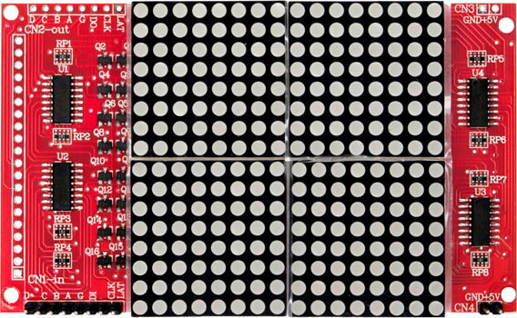
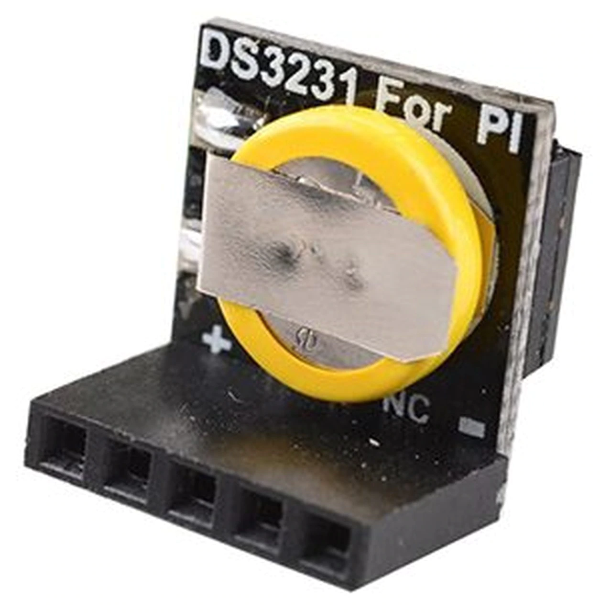

# Arduino-clock

An arduino clock with a 16x64 matrix and a DS3231 For Pi

## Getting Started

Clone the project whith typing this command on your terminal it will copy the project on your local machine

```
git clone https://github.com/omar-bb/Arduino-clock.git
```

### Prerequisites

To compile and upload the code on to the arduino you have to install the platform io extension

* PlatformIO Visual Studio Code :
    - https://platformio.org/install/ide?install=vscode

    <hr>

* PlatformIO Atom :
    - https://platformio.org/install/ide?install=atom

## Built With

* ### [Arduino](https://www.arduino.cc/)


* ### Four (16x16 Matrix)



* ### DS3231 For Pi



* ### [PlatformIO](https://platformio.org/)
    - Arduino Platform an alternative for the basic ide 

* ### [RTCLib](https://github.com/adafruit/RTClib)
    - The DS3231 library

### Montage

| Arduino   | 16*16 LED Matrix | DS3231 For Pi |
|-----------|------------------|---------------|
| 5V        | +5V              | +5V           |
| GND       | GND              | GND           |
| D5        | A                |               |
| D4        | B                |               |
| D3        | C                |               |
| D2        | D                |               |
| D6        | G                |               |
| D7        | DI               |               |
| D8        | CLK              |               |
| D9        | LAT              |               |
| (I2C) SDA |                  | SDA           |
| (I2C) SCL |                  | SCL           |

### Uploading

Click on the upload button to upload the sketch into the Arduino


## License

This project is licensed under the MIT License - see the [LICENSE.md](LICENSE.md) file for details