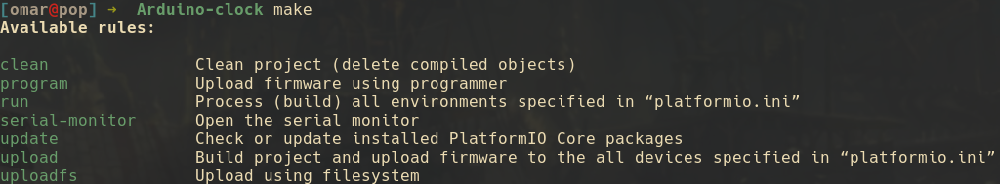

# Arduino-clock

[](https://travis-ci.org/github/omar-bb/Arduino-clock)

An arduino clock with a 16x64 matrix and a DS3231 For Pi

# Requirement

* Operating System:
    - Windows, macOS, Linux, FreeBSD, Linux ARMv6+

* Software requirements:
    - [Python](https://www.python.org/downloads/) (3.5 or greater)
    - PlatformIO Core (CLI) (you can either install it with an [Installer Script](https://docs.platformio.org/en/latest/core/installation.html#installer-script) or with the [Python Package Manager](https://docs.platformio.org/en/latest/core/installation.html#python-package-manager))
    - **NOTE:** You do not need to install PlatformIO Core (CLI) if you are going to use [PlatformIO IDE](https://docs.platformio.org/en/latest/integration/ide/pioide.html#pioide) in VSCode or Atom

* Hardware requirements:
    - [Arduino Uno](https://store.arduino.cc/arduino-uno-rev3)
    - 4 soldered [16x16 Dot LED Matrix Display](https://www.elabpeers.com/led-matrix-display.html)
    - [DS3231 Real Time Clock Module for Raspberry Pi](https://www.pishop.us/product/ds3231-real-time-clock-module-for-raspberry-pi/)

# Usage

To get started clone this repo or download zip and extract on your local machine. To clone using git

```
$ git clone https://github.com/omar-bb/Arduino-clock.git
```

## Build and Upload

To build this project and upload it to all the devices specified in “platformio.ini” run the following command

```
$ make upload
```

## Quick `make` guide

You can run `make` to get all targets specifications



# Montage

| Arduino   | 16*16 LED Matrix | DS3231 For Pi |
|-----------|------------------|---------------|
| 5V        | +5V              | +5V           |
| GND       | GND              | GND           |
| D5        | A                |               |
| D4        | B                |               |
| D3        | C                |               |
| D2        | D                |               |
| D6        | G                |               |
| D7        | DI               |               |
| D8        | CLK              |               |
| D9        | LAT              |               |
| (I2C) SDA |                  | SDA           |
| (I2C) SCL |                  | SCL           |

# Contributing

Pull requests are welcome. For major changes, please open an issue first to discuss what you would like to change.

# License

Distributed under the MIT License. See [LICENSE.md](LICENSE.md) for more information.

# Contact

Omar Ben Brahim - [@omarbb44](https://twitter.com/omarbb44) - omar@ihub-bridge.org
